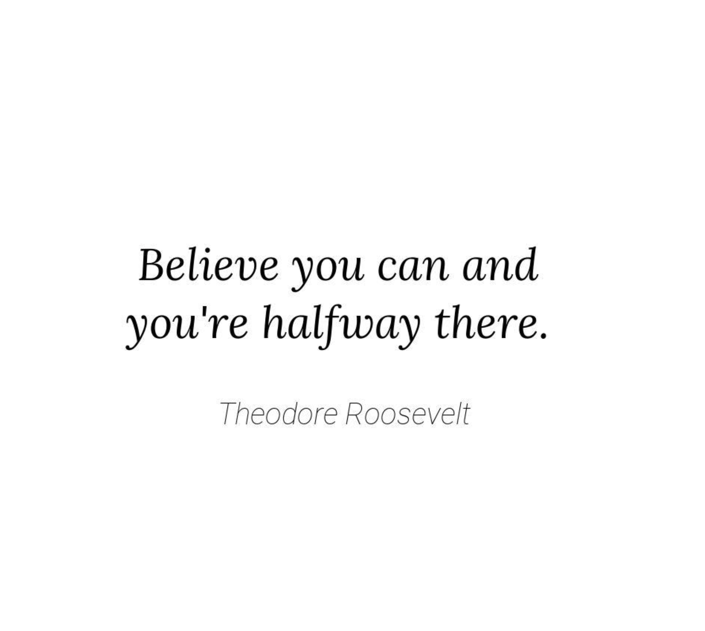
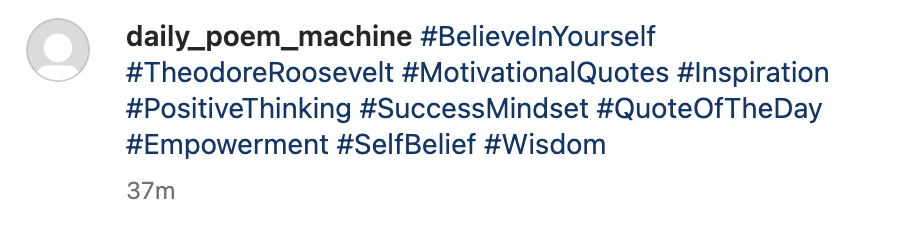

# Automated Instgram Content

## Overview

This repository creates images which are afterwards posted to an instagram account.
Basically what happens is that text is created and applied on an image. Afterwards
some fitting hashtags are created on basis of that text, those are then used
as the caption.

The text that is applied on the images and the hashtags are created using a LLM.

## Example Image

One example of such an image would be the following. The text was created through a LLM
and the text and the author are then applied on the white canvas.



Afterwards the text and author name are fed again into the LLM to generate trending
hashtags that are relevant to that post.



The LLM is also fed the information of what posts the LLM has already created in the
past. That helps to avoid creating text and therefore images which were already
created in the past.

## How to run the codebase

For creating the text that is applied on the image one needs first to think about
a general theme what is desired to be posted. For example `quotes`.

Through the `OmegaConfigLoader` from `kedro` it is then possible to create sub-versions
of theme `quotes`. For example this repository can produce quotes for the subtopics:

1. Love
2. Life
3. Breakup
4. Inspirational

All of those are specified in the `./src/registry/pipeline_registry.py`. Then those
would need to be stated also in the configuration file.

### LLM Input.

The LLM need to be steered into the right direction through `instruction_messages`
and `system_messages`. Those give the LLM the general direction of what it needs to do.

For example below you find the `YAML` entries for the `quote` category. Note that
at the bottom the LLM is also fed what the subtopic is, which text was already used
in the past, to not write the same quote again and also format instructions, which
have only something to do with the output of the LLM.

```yaml
_default_quote_instruction_message: "
  Write a famous quote from a well-known person.

  - This quote can be motivational, inspirational, or thought-provoking.
  - The quote should be less than 100 characters.
  - The main goal is to inspire and motivate the reader.
  - Be careful not to generate a quote that is already present in the list of texts
  that were already used.

  Topic: {topic}
  Text Already Used: {past_texts}
  Format instructions: {format_instructions}
  "

_default_quote_system_message: "
  You are a instagram famous AI which provides great quotes which fit the mood.
  "
```

### Running the Kedro pipelines.

To run the kedro pipelines, one would need to write

```bash
kedro run --pipeline quote_pipeline
```

## Further Notes

The project was described and explained in more detail on my blog.
